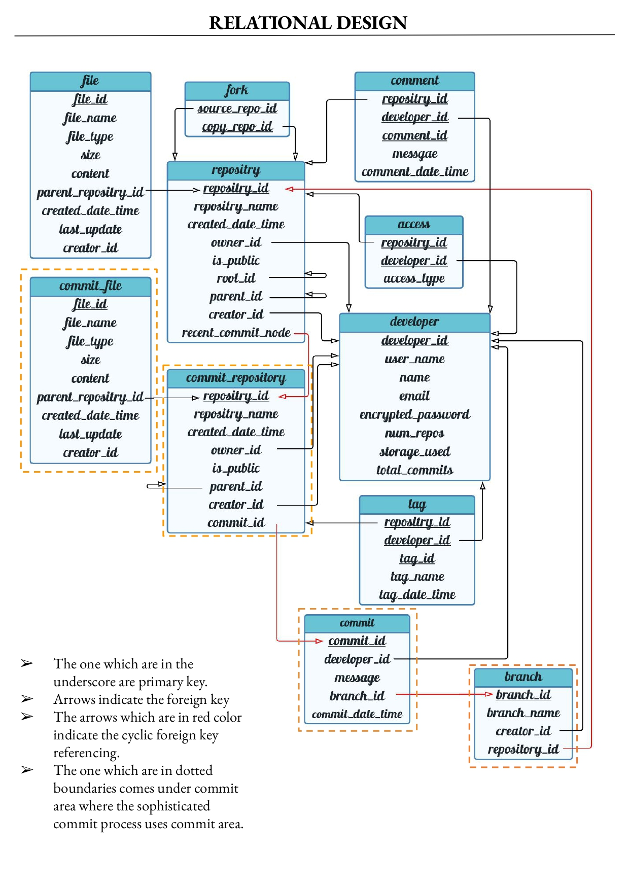
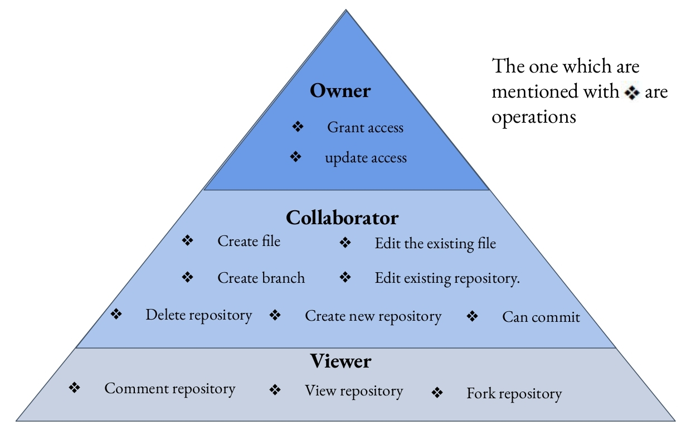

# Octopus - A database design.

Welcome to Octopus(🐙) Cloud Repository!  

This repository serves as the central hub for our ongoing efforts to design and develop a cloud-based application platform here after called as 🐙, inspired by the collaborative features of GitHub.  

# Design

ER model and relational database model are one of those which can abstract and logically represent a real-world enterprise.  

### Different views (for users) in this design

# PostgreSQL

[postgreSQL](postgreSQL)  

## References 

1) Most of the concepts used in building octopus is inspired from [Database System Concepts 7e](https://db-book.com/).
2) [PostgresSQL documentation](https://www.postgresql.org/docs/current/index.html) for postgressql.
